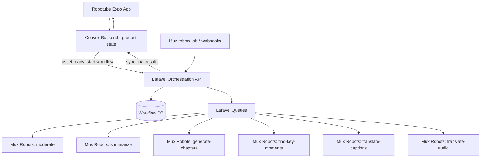
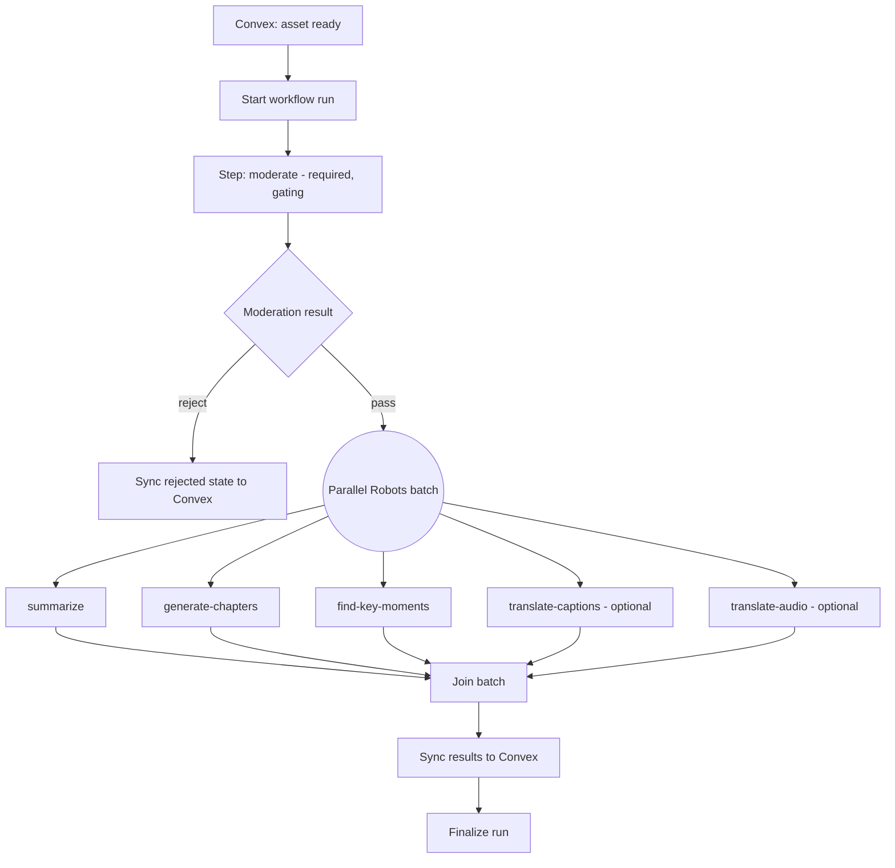

# Robotube Laravel Queue Orchestration PRD

## 1. Summary

Move Robotube's post-upload video processing orchestration out of Convex and into a dedicated Laravel backend built on Laravel Queues. Laravel becomes the control plane that runs Mux Robots jobs — moderation, summarization, chapter generation, key-moment detection, caption/audio translation, and any future Robots workflow — as durable, retryable queue jobs, then syncs final display-ready results back to Convex.

This is **infrastructure-first**: v1 uses plain Laravel queues (jobs, chains, batches, named queues, Horizon) with deterministic decision rules. The multi-agent framework (Laravel AI SDK agents: PlannerAgent, ReviewAgent, CreatorPackAgent, etc.) described in the broader platform PRD (`laravel-multi-agent-orchestration-platform-prd.md` in Obsidian) is **Phase B** and is explicitly out of scope for this document except where noted as a design constraint.

Guiding statement:

> Don't redo the Convex work. Convex keeps owning product/feed state. Laravel takes over job coordination. Mux keeps owning media and Robots execution.

## 2. Current State (What Convex Does Today)

Today the orchestration lives entirely in Convex:

- `convex/muxWebhook.ts` — receives all Mux webhooks. Routes `robots.job.*` events by workflow:
  - `moderate` → `moderation.syncModerationJobInternal`
  - `summarize` / `generate-chapters` / `find-key-moments` → `aiMetadata.syncAiMetadataJobInternal`
  - `translate-captions` → caption translation sync
  - `translate-audio` → audio translation sync
  - Also handles `video.asset.*`, static renditions, and track events for playback/product state.
- `convex/moderation.ts` — creates and polls `POST /robots/v0/jobs/moderate`, stores results on the video.
- `convex/aiMetadata.ts` — creates and polls `jobs/summarize`, `jobs/generate-chapters`, `jobs/find-key-moments`; stitches job IDs/status into asset custom metadata.
- `convex/captionTranslationsNode.ts` / `convex/audioTranslationsNode.ts` — create and poll `jobs/translate-captions` / `jobs/translate-audio`.

Problems with this shape:

- Job creation, retry, status polling, and webhook stitching are spread across five files with per-workflow bespoke state (custom metadata fields per job type).
- No unified run/step model: "where is this video in the pipeline?" requires reading several sources.
- No durable retry/backoff/rate-limit infrastructure; Convex scheduler calls are ad hoc.
- Adding a new Robots job type means another bespoke Convex module.

## 3. Target Architecture



Source-of-truth split:

```text
Laravel owns  -> workflow state (runs, steps, remote job IDs, retries, events)
Convex owns   -> Robotube product/feed state and everything the app reads
Mux owns      -> media, playback, and Robots job execution
```

Convex changes are intentionally small:

1. An action that calls Laravel's start-workflow endpoint after an asset is ready (signed, idempotent, stores `run_id`).
2. An HTTP action (or set of mutations) Laravel calls to sync status + final results (summary, chapters, key moments, translations, moderation outcome).
3. Existing display/read code stays. Existing `robots.job.*` handling in `muxWebhook.ts` is retired once Laravel handles those events; `video.asset.*` handling stays in Convex.

## 4. v1 Workflow: `robotube_video_intelligence`



v1 decision rules are deterministic — no agents:

- Moderation gate: pass/reject from Mux Robots moderation scores against configured thresholds. Borderline scores mark the run `needs_review` and sync that state to Convex (human review UI is Phase B; v1 just surfaces the state).
- Translation steps run only when requested by workflow input (Robotube metadata / user settings).
- Optional step failure (e.g., one translation fails) → run completes as `completed_partial`. Required step failure (moderation, or all metadata jobs) → run `failed`.

Phase B slots in later without rework: the moderation gate and post-batch join become `agent`-type steps (ReviewAgent, PlannerAgent) in the same engine, which is why steps carry a `type` field from day one.

## 5. Data Model (v1)

Trimmed from the platform PRD — agent and human-review tables deferred:

```text
workflow_runs
  id, workflow_key, external_type ("robotube_video"), external_id (mux_asset_id),
  status, input json, output json, started_at, finished_at

workflow_steps
  id, workflow_run_id, key, type (tool|parallel_group|join|sync|condition),
  status, queue, required bool, input json, output json, errors json,
  started_at, finished_at

step_dependencies
  workflow_step_id, depends_on_step_id

tool_invocations
  id, workflow_step_id, tool, remote_job_id, status,
  request json, response json, errors json, created_at

workflow_events
  id, workflow_run_id, workflow_step_id, type, source,
  external_event_id, payload json, created_at

workflow_artifacts
  id, workflow_run_id, workflow_step_id, type, key, url, data json, created_at
```

Indexes: `(external_type, external_id)`, `status`, `tool_invocations.remote_job_id`, `workflow_events.external_event_id`.

Run statuses: `pending, running, waiting_for_event, needs_review, completed, completed_partial, failed, cancelled`.

Step statuses: `pending, queued, running, remote_processing, completed, skipped, failed, cancelled`.

## 6. Queue Design

Named queues:

```text
orchestrator -> run start/finalize, dependency resolution, fan-out/fan-in
mux          -> Mux Robots/Video API calls (conservative concurrency, rate-limited)
webhooks     -> inbound Mux webhook matching (high concurrency, drain fast)
sync         -> writes back to Convex
default      -> everything else
```

Job catalog (v1):

```text
StartWorkflowRun
EnqueueReadySteps
RunToolStep
FanOutParallelGroup
JoinParallelGroup
HandleMuxWebhook
CompleteRemoteStep
FinalizeWorkflowRun
SyncWorkflowOutputs
CancelWorkflowRun
RetryWorkflowStep
RepairStuckWorkflowRuns   (scheduled)
PollPendingRemoteJobs     (scheduled fallback when webhooks are missed)
```

The core async lesson the design encodes:

```text
local queue job completion != remote Robots job completion
```

`RunToolStep` creates the remote Robots job, stores `remote_job_id` on `tool_invocations`, and marks the step `remote_processing`. The step completes only when a `robots.job.*` webhook (or the poll fallback) arrives and `CompleteRemoteStep` matches it by `remote_job_id`, then enqueues dependent steps.

## 7. Mux Tool Adapters (v1)

One shared Robots client (`https://api.mux.com/robots/v0`), one adapter per workflow:

```text
mux_robots.moderate            POST /jobs/moderate            GET /jobs/moderate/{id}
mux_robots.summarize           POST /jobs/summarize           GET /jobs/summarize/{id}
mux_robots.generate_chapters   POST /jobs/generate-chapters   GET /jobs/generate-chapters/{id}
mux_robots.find_key_moments    POST /jobs/find-key-moments    GET /jobs/find-key-moments/{id}
mux_robots.translate_captions  POST /jobs/translate-captions  GET /jobs/translate-captions/{id}
mux_robots.translate_audio     POST /jobs/translate-audio     GET /jobs/translate-audio/{id}
```

Adapter contract:

- Input/output schema per tool.
- Passthrough metadata on job creation: `run_id`, `step_id`, `mux_asset_id`, `user_id`.
- Idempotency guard: retrying a step reuses an existing live `remote_job_id` instead of creating a duplicate remote job.
- Retry policy + shared `mux` rate-limit bucket.
- Fake adapter mode for local dev and tests.

Convex sync adapters:

```text
robotube.sync_video_metadata   (summary, chapters, key moments, translations)
robotube.sync_moderation_state (pass / rejected / needs_review)
robotube.sync_run_status       (running / ready / failed states for UI)
```

## 8. API Design

```http
POST /api/workflows/robotube_video_intelligence/runs   (signed; called by Convex)
GET  /api/workflow-runs/{runId}
POST /api/workflow-steps/{stepId}/retry
POST /api/workflow-runs/{runId}/cancel
POST /api/webhooks/mux                                  (Mux signature verified)
```

Rules:

- Start-run is idempotent on `external_type=robotube_video, external_id=mux_asset_id` — duplicate Convex calls return the same active run.
- Webhook handler stores the raw event first, returns 2xx fast, and queues matching on the `webhooks` queue.
- Duplicate webhooks are deduped by external event ID.
- Convex↔Laravel calls are signed with a shared secret in both directions.
- Mux webhook config: point `robots.job.*` events at Laravel; Convex keeps receiving `video.asset.*` events it needs for playback/product state (Mux supports multiple webhook destinations).

## 9. Non-Goals (v1)

- No AI agents, Laravel AI SDK, or agent invocation tables (Phase B).
- No human review UI (v1 only surfaces `needs_review` state to Convex).
- No Creator Pack generation (clips, thumbnails, watermarks) — Phase B.
- No visual workflow builder or general-purpose workflow product.
- No Convex rewrite; no schema migration of product state.
- No changes to upload flow, playback, feed, live streaming, or chat.

## 10. Implementation Loops

Loop rule: one loop = one vertical slice, one verification command, one checklist update.

### Loop 0: Boundary Audit

- [ ] Document current Convex Robots flow (files above) in `docs/robotube-orchestration-boundary.md`.
- [ ] Confirm trigger path: Convex calls Laravel after asset ready (default), vs Mux webhook starting Laravel directly.
- [ ] Confirm which webhook events move to Laravel (`robots.job.*`) vs stay in Convex (`video.asset.*`, tracks, renditions).

### Loop 1: Laravel App Bootstrap

- [ ] Create Laravel app (separate repo or `orchestrator/` — decide and record).
- [ ] Configure database + Redis queue connection, install Horizon.
- [ ] `GET /health`, signed-request middleware, `.env.example` for Mux/Convex/queue/db.
- [ ] Acceptance: `php artisan test` passes; a smoke job processes on `default`.

### Loop 2: Workflow Data Model

- [ ] Migrations, models, factories for the Section 5 tables + status enums.
- [ ] Seed `robotube_video_intelligence` definition.
- [ ] Acceptance: test creates a run with pending steps from an empty database.

### Loop 3: Orchestrator Engine Minimal Slice

- [ ] `StartWorkflowRun`, `EnqueueReadySteps`, `RunToolStep`, `CompleteRemoteStep`, `FinalizeWorkflowRun`.
- [ ] Fan-out/join for parallel groups; required-vs-optional rules; Horizon tags (`workflow`, `run`, `step`, `external`).
- [ ] Acceptance: fake sequential workflow completes; fake parallel workflow completes; failed required step fails the run; failed optional step yields `completed_partial`.

### Loop 4: Mux Robots Tool Adapters

- [ ] Shared Robots client + the six adapters in Section 7, with passthrough metadata and idempotency guard.
- [ ] Fake adapter mode.
- [ ] Acceptance: fake client produces remote job IDs for all tools; retried step reuses an existing remote job.

### Loop 5: Mux Webhook Ingress

- [ ] `POST /api/webhooks/mux` with signature verification, raw event storage, fast 2xx, queued matching.
- [ ] Match `robots.job.*` events to `tool_invocations.remote_job_id`; complete/fail steps; unlock dependents; dedupe by event ID.
- [ ] Acceptance: signed fake webhook completes the right step; duplicates don't double-complete; unknown events stored as unmatched.

### Loop 6: Start-Workflow API + Convex Trigger

- [ ] Signed, idempotent `POST /api/workflows/robotube_video_intelligence/runs`.
- [ ] Convex action calling it after asset ready, storing `run_id`, with retry/backoff and a local fake mode.
- [ ] Acceptance: a ready asset starts exactly one run; duplicate triggers reuse it; bad signatures rejected.

### Loop 7: Sync Back to Convex

- [ ] Convex HTTP action/mutations for Laravel to sync status, metadata, and moderation state.
- [ ] Laravel sync adapters (Section 7), idempotent by `run_id` + `mux_asset_id`.
- [ ] Acceptance: fake run updates fake Convex adapter; replayed sync doesn't duplicate state; dev deployment receives a real status update.

### Loop 8: Cut Over Robots Handling from Convex

- [ ] Point `robots.job.*` webhooks at Laravel; run both paths side by side for one test asset.
- [ ] Retire Robots job creation + `robots.job.*` routing from `muxWebhook.ts`, `moderation.ts`, `aiMetadata.ts`, `captionTranslationsNode.ts`, `audioTranslationsNode.ts` (keep read/display code and Convex-owned events).
- [ ] Acceptance: one real upload completes the full pipeline via Laravel with no Convex Robots calls.

### Loop 9: End-to-End Demo + Resilience

- [ ] `robotube:demo-run` artisan command: fake run, simulated webhooks, verified final status, non-zero exit on failure.
- [ ] `RepairStuckWorkflowRuns` + `PollPendingRemoteJobs` scheduled commands.
- [ ] Live smoke test with one known Mux asset.
- [ ] Acceptance: full local run without live APIs; a deliberately stuck run is repairable; a missed webhook recovers via polling.

### Loop 10 (optional, pre-Phase B): Deploy

- [ ] Laravel Cloud (or chosen host) staging: managed queues (`orchestrator`, `mux`, `webhooks`, `sync`), scheduler, env vars, public webhook URL.
- [ ] Acceptance: staging processes one real Robotube upload end to end.

## 11. Phase B Preview (Deferred)

Kept here only so v1 decisions don't paint us into a corner:

- Steps already carry `type`; adding `agent` steps means new job (`RunAgentStep`) + `agent_invocations` table, no engine rework.
- The moderation gate and post-batch join are where ReviewAgent/PlannerAgent slot in.
- Creator Pack (clips via `mux_video.create_clip`, thumbnails, watermarked assets) becomes a second parallel group after the review decision.
- Human review tasks become a first-class step type with their own queue.

See the full platform PRD in Obsidian (`Mux/Presentations/laravel-multi-agent-orchestration-platform-prd.md`) for the agent framework, dashboard, and talk framing.

## 12. Open Questions

- Laravel app location: separate repo vs `orchestrator/` directory in this repo?
- Trigger: should Convex call Laravel, or should Mux `video.asset.ready` hit Laravel directly (Convex then only receives syncs)?
- Sync channel into Convex: HTTP action vs a small authenticated internal API?
- Which existing Convex fields keep their current shape so the Expo UI needs zero changes at cutover?
