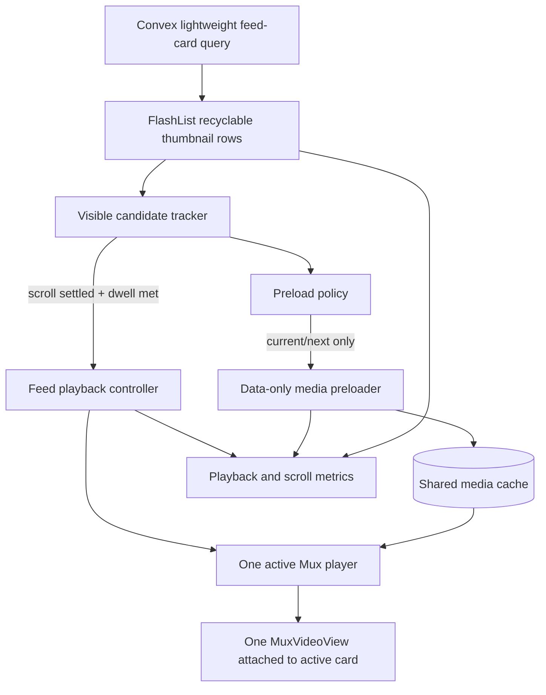

# Robotube News Feed Performance Architecture PRD

> **Implementation status.** A checked box means the item is fully satisfied by
> artifacts on this branch. Items needing physical-device runs, a live Convex
> deployment, instrumentation wired into `app/`, `components/`, or `hooks/`, or
> a production rollout are left unchecked. See
> [`news-feed-performance-baseline.md`](./news-feed-performance-baseline.md) for
> what was and was not measured, and
> [`news-feed-performance-operations.md`](./news-feed-performance-operations.md)
> for the instrumentation, flags, and kill switch that exist today.

## 1. Summary

Rebuild Robotube's news-feed playback path around a lightweight recyclable list, one attached active video player, a tightly bounded preload strategy, and a card-sized Convex response.

The implementation is deliberately phased. Each phase has a measurable exit gate and can be checked off independently. Later phases must not compensate for regressions introduced in earlier phases.

Guiding statement:

> Scrolling owns the frame budget. Playback and preloading may use the remaining budget, but they must never make the list janky.

## 2. Problem Statement

The current news feed combines several expensive behaviors:

- FlashList recycling is disabled with `maxItemsInRecyclePool={0}`.
- Clipped subviews are retained with `removeClippedSubviews={false}`.
- Feed focus changes while the user is scrolling, causing player creation, release, native commands, and React rerenders during the scroll-critical path.
- The preview window can keep four Mux players around: active, one behind, and two ahead.
- Each preview card can render both an Expo thumbnail and a second poster image inside `MuxVideoView`.
- Feed previews request a two-second startup buffer.
- The initial 16-item Convex response includes detail-page AI metadata that the feed does not render.
- Feed construction performs per-video metadata, uploader, and avatar lookups.

Measured during the initial investigation:

| Measurement | Current observation |
|---|---:|
| Initial page size | 16 videos |
| Full feed response | ~69.6 KB |
| Approximate card-only response | ~7.4 KB |
| AI key moments sent to feed | 28 |
| Transcript cues sent to feed | 156 |
| Mux master-manifest spot check | 0.38 seconds |
| 1280px thumbnail spot check | 0.57 seconds / 109 KB |

These measurements indicate that the primary bottleneck is the application integration: list churn, native player lifecycle work, buffering policy, duplicated media surfaces, and an oversized feed response.

## 3. Goals

- Keep vertical scrolling smooth while videos are present and while pagination is loading.
- Guarantee that at most one feed video is playing.
- Use one attached active player surface for the normal feed path.
- Preload only media likely to play next, without attaching several hidden player surfaces.
- Start a warm/preloaded preview without a visible loading interruption.
- Keep memory and decoder usage bounded regardless of feed length.
- Send only card data in the feed query and load rich AI metadata on the video detail page.
- Preserve current behavior for navigation, playback position handoff, tab focus, looping, muting, search results, and profile cards.
- Add enough instrumentation to detect regressions before rollout.

## 4. Success Metrics

Final targets must be recorded separately for iOS and Android and segmented by cold versus warm media cache. The currently available physical iPhone is the primary performance reference during development. Simulator/emulator results may validate behavior and identify large regressions, but they do not satisfy physical-device performance gates. Physical Android measurements are required before broad Android rollout, not before Phase 0 can begin.

| Metric | Target |
|---|---:|
| Feed response for 16 cards | <= 15 KB serialized |
| Simultaneously playing feed videos | Exactly 0 or 1 |
| Attached feed player surfaces | 1 during playback |
| Standby full-player instances | 0 preferred; 1 maximum behind an explicit fallback |
| Warm/preloaded time to first frame, p75 | <= 300 ms |
| Cold time to first frame, p75 | <= 1.2 seconds on reference Wi-Fi |
| Dropped-frame ratio during standard scroll scenario | < 2% on reference devices |
| Player creation/release during fast fling | 0 until focus is committed |
| Memory after repeated 50-item down/up scroll | No unbounded growth; returns within 20% of steady-state |
| Feed pagination | No duplicated or missing cards |
| Wrong-video or stale-poster incidents | 0 in automated and manual test matrix |

If a numeric target is not feasible after Phase 0, update the target with the measured baseline, rationale, and an approved replacement before implementation continues.

## 5. Non-Goals

- Replacing Mux as the video streaming provider.
- Replacing FlashList or Convex unless measurements prove a blocking defect.
- Redesigning the feed UI.
- Adding unmuted autoplay.
- Preloading arbitrary portions of the feed.
- Loading summaries, chapters, transcripts, key moments, or tags in the feed-card query.
- Optimizing the full-screen video detail page beyond the handoff needed by this project.
- Building a general-purpose media cache product.

## 6. Target Architecture



State model:

```text
visible candidate
      |
      | scroll settles and dwell threshold passes
      v
committed active item
      |
      +--> attach shared player surface
      +--> play muted and looped
      +--> preload the next likely item
```

Source-of-truth split:

```text
FlashList                 -> row layout, visibility, and recycling
Feed focus controller     -> candidate index and committed active index
Feed playback controller  -> active source, play/pause, position, lifecycle
Feed preload policy       -> what may preload and when it must cancel
Convex feed query         -> card-only display data
Video detail query        -> summaries, tags, chapters, key moments, transcripts
```

## 7. Architecture Decisions

### 7.1 Candidate focus is not committed focus

Viewability callbacks may update a cheap candidate value during scrolling. They must not create, release, attach, replace, play, or pause a native player.

The candidate becomes committed only when:

- the list is no longer dragging or in momentum;
- the same candidate meets the dwell/visibility requirement;
- the Home tab is focused and the app is active; and
- the candidate is still mounted and eligible to autoplay.

### 7.2 One active surface

The feed owns one active `MuxVideoPlayer` and attaches one `MuxVideoView` to the committed card. Changing cards reuses the controller and replaces the active source after the new target is committed.

If reattaching a shared native surface proves unsafe in the installed Mux player version, a maximum two-slot active/standby pool may be enabled temporarily behind a feature flag. It is not the default target.

### 7.3 Preload bytes, not a collection of hidden views

The installed `@mux/mux-react-native-player` version exposes a multi-player feed hook but does not expose a public data-only preload API. Phase 3 must therefore validate one of these implementations:

1. Upgrade or extend the Mux package with platform preloading that feeds the same cache/source used by the active player.
2. Add a small native preload adapter using Android Media3 and the equivalent iOS media APIs.
3. Use one bounded standby player as a measured fallback only if it demonstrably transfers cached media to active playback without harming scroll or memory.

A preload implementation that downloads data but cannot be reused by the active player does not satisfy this PRD.

### 7.4 Card data and detail data are separate contracts

The feed-card contract includes only:

```text
muxAssetId
playbackId
thumbnailUrl
title
channelName
channelAvatarUrl
durationSeconds
createdAtMs
```

Rich metadata remains available through the video-detail query. Search can have a separate result-card contract if snippets or tags are required.

## 8. Phased Implementation Checklist

### Phase 0: Baseline, Instrumentation, and Test Matrix

Goal: establish repeatable measurements before changing runtime behavior.

- [ ] Record the available physical iPhone model, iOS version, storage state, and battery/thermal conditions used for performance runs.
- [ ] Use the available physical iPhone as the primary Phase 0 performance reference.
- [x] Define one or more iOS Simulator profiles for functional testing; do not use simulator frame, CPU, memory, or first-frame measurements as physical-device results.
- [x] Configure an Android emulator profile for functional correctness when Android tooling is available.
- [ ] Configure a constrained Android emulator profile with reduced RAM/CPU for coarse stress testing; label all resulting measurements as emulator-only.
- [ ] Document how a physical Android device will be obtained before broad Android rollout: borrowed device, cloud physical-device service, or dedicated test hardware.
- [x] Define reference network states: warm cache, cold Wi-Fi cache, constrained network, and offline recovery.
- [ ] Create a deterministic test feed with at least 50 playable videos.
- [x] Document the test scenarios: cold launch, warm launch, slow scroll, fast fling, reverse scroll, pagination, tab switch, background/foreground, and open-detail/back.
- [x] Add development-only counters for mounted feed rows, attached player surfaces, live player instances, source replacements, preload starts, preload cancellations, and preload cache hits.
- [ ] Record candidate-change and committed-focus timestamps.
- [ ] Record playback-requested, source-ready, first-frame, buffering-start, buffering-end, and playback-error timestamps.
- [ ] Capture JS/UI frame rate, dropped frames, memory, CPU, and network bytes during the standard 50-item scenario.
- [ ] Measure the current feed query response size and execution time for 16 and 48 items.
- [ ] Store baseline results in `docs/news-feed-performance-baseline.md`.
- [ ] Confirm measurements distinguish development-build overhead from release-build behavior.

Phase 0 exit gate:

- [ ] The same test scenario can be run twice with results that are comparable.
- [ ] Physical-device baseline metrics exist for the available iPhone.
- [ ] iOS Simulator functional results exist and are clearly labeled as non-performance results.
- [x] Android emulator functional results exist, or the missing Android tooling is recorded with an owner and target phase.
- [x] Physical Android validation is scheduled as a rollout dependency and does not block Phase 0.
- [ ] Current player and row counts are observable without reading logs manually.

### Phase 1: Restore List Virtualization and Remove Scroll-Path Churn

Goal: make scrolling cheap before changing the playback architecture.

- [ ] Remove `maxItemsInRecyclePool={0}` from the Home feed.
- [ ] Remove the explicit `removeClippedSubviews={false}` override and validate platform defaults.
- [ ] Restore separate candidate and committed focus states.
- [ ] Prevent committed-focus updates while dragging or momentum scrolling.
- [ ] Commit focus only after scroll settle plus the agreed dwell threshold.
- [ ] Stabilize `renderItem` with `useCallback`.
- [ ] Stabilize `keyExtractor`, end-reached handlers, and list header/footer elements where measurements show rerenders.
- [ ] Replace the per-render `extraData` object with a stable primitive or memoized structure.
- [ ] Memoize `FeedVideoCard` with a comparison limited to card data and active/player state.
- [ ] Add `recyclingKey={item.muxAssetId}` to recycled Expo images where required to prevent stale thumbnails.
- [ ] Verify recycled rows never display the previous card's thumbnail, title, duration, or player surface.
- [ ] Apply the same list rules to search results where the shared feed card autoplays.

Phase 1 exit gate:

- [ ] No player creation, release, or source replacement occurs during a fast fling.
- [ ] Row mount/unmount counts remain bounded during a 50-item scroll.
- [ ] No stale content appears in recycled cells.
- [ ] Scroll dropped-frame ratio improves from baseline without regressing functionality.

### Phase 2: Introduce One Shared Feed Playback Controller

Goal: replace per-window player ownership with one active feed player.

- [ ] Create `hooks/use-feed-playback-controller.ts`.
- [ ] Give the controller one active player and one committed `muxAssetId`.
- [ ] Move mute, loop, play, pause, source replacement, and lifecycle commands into the controller.
- [ ] Ensure only the committed active card receives the player/surface.
- [ ] Detach the surface before a recycled card is rebound to different content.
- [ ] Replace the active source only after focus is committed.
- [ ] Keep the thumbnail visible until the active player emits its first frame.
- [ ] Remove the duplicate `poster` from `MuxVideoView` when the underlying Expo thumbnail supplies the placeholder.
- [ ] Remove `startupBufferDuration={2}` from feed previews and start from the package default.
- [ ] Tune startup buffering only after cold and warm first-frame metrics are captured.
- [ ] Pause playback immediately when the tab loses focus or the app backgrounds.
- [ ] Release the active player when the feed screen is destroyed.
- [ ] Preserve the current preview position when navigating to `/video/[muxAssetId]`.
- [ ] Ensure returning from the detail screen restores a valid muted feed state without playing two videos.
- [ ] Remove Home-feed usage of `useMuxVideoFeed`.
- [ ] Decide whether `components/inline-video-player.tsx` is deleted, restored for another screen, or replaced by the shared controller; document the decision.

Phase 2 exit gate:

- [ ] Exactly one feed player surface is attached while a preview is active.
- [ ] At most one feed video is playing in every navigation and lifecycle scenario.
- [ ] No black/stale frame is visible when a recycled row becomes active.
- [ ] Warm source changes meet or improve the Phase 1 first-frame measurement.
- [ ] Search and profile screens retain their intended behavior.

### Phase 3: Add Bounded Predictive Preloading

Goal: make the next likely video start quickly without sacrificing scrolling or memory.

- [ ] Define a `FeedPreloader` interface independent of platform implementation.
- [ ] Complete a technical spike for data-only Mux preloading on Android and iOS.
- [ ] Document whether the installed package can be upgraded, extended, or needs a native adapter.
- [ ] Prove that preloaded bytes/samples are consumed by the active player rather than downloaded twice.
- [ ] Default the preload window to the committed current item plus one direction-aware next item.
- [ ] Prioritize the active playback request over every preload request.
- [ ] Cancel or reprioritize preload work when scroll direction changes.
- [ ] Suspend preload work during a fast fling.
- [ ] Suspend and release preload work when the app backgrounds or the feed loses focus.
- [ ] Remove media from the preload window when it becomes distant.
- [ ] Add a bounded cache key using playback ID, rendition constraints, and clipping parameters.
- [ ] Verify reverse scrolling can reuse cached media without retaining an unbounded source list.
- [ ] Add cache-hit, wasted-preload-byte, and preload-to-play conversion metrics.
- [ ] Keep a feature-flagged maximum-one-standby-player fallback only if data-only preloading is unavailable.
- [ ] Disable preloading rather than ship a fallback that regresses scrolling or memory.

Phase 3 exit gate:

- [ ] Warm/preloaded p75 time to first frame meets the target or has an approved revised target.
- [ ] Preloading does not create additional attached visible surfaces.
- [ ] No more than the current and next eligible media items retain preload resources.
- [ ] The 50-item memory scenario remains bounded.
- [ ] Wasted preload data is measured and within the agreed budget.

### Phase 4: Split Feed-Card and Video-Detail Data

Goal: reduce time before the list can render and before the first player can be prepared.

- [ ] Add a dedicated `FeedVideoCardItem` type containing only the Section 7.4 fields.
- [ ] Update `listFeedVideosPaginated` to return the lightweight card contract.
- [ ] Stop serializing summaries, tags, chapters, key moments, transcript cues, and key-moment generation state in the feed response.
- [ ] Keep rich metadata available through `getFeedVideoByMuxAssetId` or a dedicated detail query.
- [ ] Eliminate per-card `components.mux.videos.getVideoByMuxAssetId` calls from the hot feed query.
- [ ] Store or denormalize display-ready title and uploader data in an indexed feed-read model.
- [ ] Resolve repeated channel/avatar data once per distinct uploader, not once per video.
- [ ] Avoid regenerating identical Convex storage URLs for every card in the same page.
- [ ] Preserve stable descending pagination and cursor behavior.
- [ ] Add a response-shape test that fails if rich metadata is added back to the card query.
- [ ] Add query tests for missing playback IDs, deleted assets, missing uploaders, and avatar fallbacks.
- [ ] Update search and profile queries to use explicit card contracts appropriate to those screens.

Phase 4 exit gate:

- [ ] A 16-card feed response is <= 15 KB serialized.
- [ ] The feed query performs no per-video Mux component subquery.
- [ ] Initial cards render before rich video metadata is requested.
- [ ] Detail, search, and profile screens still receive every field they render.
- [ ] Pagination has no duplicate, missing, or reordered entries.

### Phase 5: Adaptive Media and Image Policy

Goal: preserve performance across device classes and network conditions.

- [ ] Define low-, standard-, and high-capability device policies.
- [ ] Define Wi-Fi, cellular, constrained-network, and low-data preload policies.
- [ ] Disable or reduce preloading when memory, CPU, thermal, or I/O pressure is high.
- [ ] Keep feed previews muted and cap preview resolution at an appropriate mobile rendition.
- [ ] Validate whether `720p` remains the best maximum for the feed on representative screen densities.
- [ ] Request thumbnail widths based on rendered size and device pixel ratio instead of always using 1280px.
- [ ] Use one image cache path and one poster representation per card.
- [ ] Prefetch only the active/next thumbnail and cancel stale image work.
- [ ] Verify active playback always wins bandwidth contention against thumbnails and media preload.
- [ ] Add safe fallbacks for preload errors, cache corruption, offline state, and memory warnings.

Phase 5 exit gate:

- [ ] Low-tier reference devices meet the approved scroll and memory targets.
- [ ] Constrained networks show a thumbnail fallback instead of prolonged blank video.
- [ ] Active playback is not delayed by stale preload requests.
- [ ] Image and media memory remain bounded during repeated scrolling.

### Phase 6: Rollout, Regression Protection, and Cleanup

Goal: ship incrementally and remove the old architecture only after the new path is proven.

- [x] Add feature flags for shared-player playback, predictive preloading, and the lightweight feed query.
- [x] Support an immediate remote kill switch for preloading.
- [ ] Run the automated test suite and the complete manual device matrix.
- [ ] Validate Android behavior on at least one physical Android device before any external Android rollout.
- [ ] Validate Android performance on a representative mid-tier physical or cloud-hosted Android device before rollout exceeds the internal cohort.
- [ ] Keep Android rollout disabled if only emulator results are available; iOS rollout may proceed independently after its own gates pass.
- [ ] Compare every final metric against the Phase 0 baseline.
- [ ] Roll out to an internal cohort.
- [ ] Roll out to 10% and monitor first-frame time, buffering, crashes, memory warnings, playback errors, and dropped frames.
- [ ] Roll out to 50% after the observation window passes.
- [ ] Roll out to 100% after the second observation window passes.
- [ ] Remove the old multi-player feed code after the rollback window closes.
- [ ] Remove temporary counters and retain production-safe performance telemetry.
- [ ] Update this PRD with final metric results and check every completed item.
- [x] Add the architecture and operational notes to the repository README or a dedicated engineering document.

Phase 6 exit gate:

- [ ] All success metrics meet their approved targets.
- [ ] Physical-device results exist for every platform included in the production rollout.
- [ ] No open P0/P1 feed performance or playback correctness bugs remain.
- [x] The feature flags have documented owners and removal dates.
- [ ] The previous architecture has been removed or has an explicit retained-use justification.

## 9. Functional Acceptance Checklist

- [ ] The correct card autoplays after scroll settle.
- [ ] Fast flings do not briefly play intermediate cards.
- [ ] Only one preview plays at a time.
- [ ] Previews are muted and loop correctly.
- [ ] The thumbnail remains visible until the first video frame.
- [ ] Opening a video passes the current preview time to the detail page.
- [ ] Returning from detail does not produce simultaneous audio/video playback.
- [ ] Switching tabs pauses the feed immediately.
- [ ] Backgrounding pauses playback and cancels unnecessary preload work.
- [ ] Foregrounding does not autoplay a stale offscreen card.
- [ ] Pull-to-top behavior focuses the first eligible card.
- [ ] Live Now header content does not incorrectly force the first VOD preview to play offscreen.
- [ ] Pagination does not interrupt the active player.
- [ ] Reverse scrolling reuses cached media when available.
- [ ] Search-result previews follow the same one-active-player guarantee.
- [ ] Profile cards remain thumbnail-only unless a separate autoplay requirement is approved.
- [ ] Accessibility, reduced-motion, and low-data preferences are respected.

## 10. Automated Test Plan

Unit tests:

- [ ] Candidate-to-committed focus state transitions.
- [ ] Scroll begin/end and momentum begin/end behavior.
- [ ] Preload window selection and cancellation.
- [ ] Player lifecycle on tab focus and app state changes.
- [ ] Exactly-one-playing invariant.
- [x] Feed-card response projection.
- [ ] Stable pagination and missing-data fallbacks.

Integration tests:

- [ ] Recycled cell receives a new item without stale image or player state.
- [ ] Active source switches only after committed focus changes.
- [ ] Preloaded source becomes active without a duplicate download.
- [ ] Detail navigation receives the preview position.
- [ ] Background/foreground and tab switching pause/resume correctly.
- [ ] Feature-flag and kill-switch paths.

Release-build performance tests:

- [ ] Run the standard 50-item slow-scroll scenario on the physical iPhone.
- [ ] Run the standard 50-item fling and reverse-fling scenario on the physical iPhone.
- [ ] Run the cold and warm first-frame scenario on the physical iPhone.
- [ ] Run pagination while active playback continues on the physical iPhone.
- [ ] Run the ten-minute repeated down/up scroll soak on the physical iPhone.
- [ ] Run the constrained-network and offline-recovery scenario on the physical iPhone.
- [ ] Repeat the release-build performance scenarios on physical Android hardware before Android rollout.
- [ ] Use simulators/emulators for functional repetition only; do not merge their performance numbers with physical-device results.

Required verification commands:

```bash
npm run lint
npx tsc --noEmit
```

Platform release builds and automated tests must be added to this section when their commands are established.

## 11. Observability Events

Minimum event vocabulary:

```text
feed_query_started
feed_query_received
feed_first_cards_rendered
feed_candidate_changed
feed_focus_committed
feed_player_created
feed_player_attached
feed_player_detached
feed_source_replace_started
feed_playback_requested
feed_source_ready
feed_first_frame
feed_buffering_started
feed_buffering_ended
feed_playback_error
feed_preload_started
feed_preload_completed
feed_preload_cancelled
feed_preload_cache_hit
feed_preload_promoted_to_active
```

Common fields:

```text
session_id
screen
mux_asset_id
playback_id_hash
feed_index
device_class
platform
network_class
cache_state
is_preloaded
elapsed_ms
error_code
```

Do not log raw authentication data, signed playback tokens, private playback URLs, captions, transcripts, or user-provided AI metadata.

## 12. Risks and Mitigations

| Risk | Mitigation |
|---|---|
| Recycled row briefly shows the wrong native surface | Detach before rebind, key image content, and add recycled-cell integration tests |
| Shared player reattachment produces a black flash | Keep thumbnail until first-frame event and measure attach timing |
| Mux package cannot preload data without a full view | Add a native adapter or disable preload; allow one measured standby only as a feature-flagged fallback |
| Android and iOS caching behave differently | Implement and report metrics separately by platform |
| Aggressive preload competes with active playback | Give active playback strict priority and cancel preload under contention |
| Feed read model becomes stale | Update it from the same asset/user mutation paths and add repair/backfill tooling |
| Lightweight DTO breaks detail/search screens | Use separate explicit types and response-shape tests |
| Performance looks good in development but regresses in production | Make release-build device measurements part of every phase gate |
| Feature flags leave permanent duplicate code | Assign removal dates and make old-path cleanup part of Phase 6 |

## 13. Rollback Strategy

- Shared-player, preloading, and lightweight-query changes ship behind independent flags.
- Preloading can be disabled without reverting the shared-player or list improvements.
- The old feed query remains available until the lightweight query is validated at full rollout.
- A rollback must preserve feed readability: thumbnail cards and tap-to-open remain available even if autoplay is disabled.
- Any increase in crash rate, memory warnings, wrong-video incidents, or playback errors above the agreed threshold pauses rollout automatically.

## 14. Definition of Done

This project is complete when:

- [ ] Every phase exit gate is checked.
- [ ] Final iOS and Android metrics are recorded against the Phase 0 baseline.
- [ ] The Home feed uses recyclable cells and one attached active player surface.
- [ ] Preloading is bounded, reusable by active playback, and safe to disable.
- [ ] The feed query sends only card data.
- [ ] All functional acceptance checks pass.
- [ ] All automated checks and release-build performance scenarios pass.
- [ ] Rollout reaches 100% without unresolved P0/P1 regressions.
- [ ] Old feed architecture and expired flags are removed.
