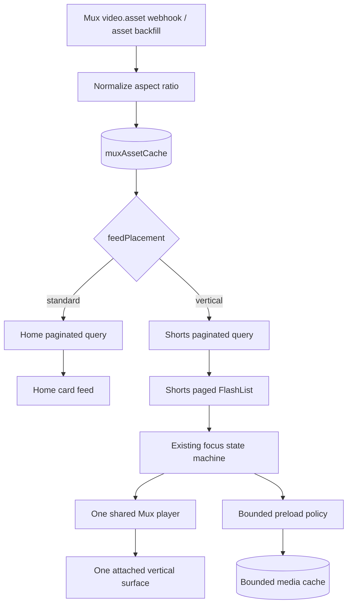

# Robotube 9:16 Vertical Video Feed PRD

> **Status and checkbox rule.** This document defines the product and
> implementation plan. A checked box means the work is already evidenced in the
> current repository or was completed during the PRD investigation. Unchecked
> boxes are implementation or rollout work still to be done.

## 1. Summary

Add a fifth native tab, **Shorts**, that presents a TikTok-style, full-viewport,
vertically paged feed containing only ready videos with an exact normalized
display aspect ratio of **9:16**.

Robotube will keep both viewing modes:

- **Home** remains the YouTube-style card feed and, after migration, contains
  ready videos whose aspect ratio is not 9:16.
- **Shorts** contains only ready 9:16 videos.
- Search, profile, and video detail remain format-agnostic and may show either
  kind of video.

The interaction model is informed by
[Mux Slop Social](https://github.com/muxinc/Slop-Social), especially its
[paged FlashList](https://github.com/muxinc/Slop-Social/blob/main/components/video-feed/video-feed.tsx)
and
[full-screen video item](https://github.com/muxinc/Slop-Social/blob/main/components/video-feed/video-item.tsx).
Robotube will adapt those ideas to its existing Mux player, Convex read model,
single-player controller, focus state machine, bounded preload policy, and
telemetry rather than copying Slop Social's separate `expo-video` stack.

Guiding statement:

> One library, two viewing modes: wide and general-format videos belong on Home;
> exact 9:16 videos belong in a fast, immersive Shorts feed.

## 2. Problem Statement

Robotube currently presents every ready asset in the same 16:9 Home card
surface. Portrait 9:16 media either receives a presentation designed for wide
video or has to be opened on a detail screen before it feels native to its
format.

The application already has most of the difficult feed infrastructure:

- Expo Router native tabs in `app/(tabs)/_layout.tsx`.
- A paginated Convex feed query backed by `muxAssetCache`.
- FlashList recycling and pagination in `app/(tabs)/index.tsx`.
- Candidate-versus-committed focus handling.
- One active Mux player and one attached player surface per feed screen.
- Direction-aware, bounded preload policy.
- Lifecycle, playback, performance, and privacy-safe telemetry.

What is missing is authoritative aspect-ratio classification, an indexed
vertical-only query, a paged full-viewport presentation, and format-exclusive
routing between Home and Shorts.

## 3. Product Decisions

These are v1 decisions, not open questions:

1. The user-facing tab name is **Shorts**. The internal route is
   `app/(tabs)/shorts.tsx`.
2. The tab appears immediately after Home:
   `Home → Shorts → Upload → Search → Profile`.
3. Feed placement is exclusive after migration:
   - normalized ratio `9:16` → Shorts;
   - every other known ratio → Home.
4. Search, profile, upload history, and video detail may show all ratios.
5. Classification uses Mux asset metadata on the server. The client must not
   infer eligibility from screen dimensions, thumbnail dimensions, or player
   layout.
6. Qualification is exact after integer normalization. There is no visual
   tolerance band in v1.
7. A missing or invalid ratio is `unknown`, not assumed to be 9:16.
8. During migration, unknown legacy assets remain visible on Home and are
   excluded from Shorts. The exclusive Home query ships only after the backfill
   and coverage gate pass.
9. Shorts autoplay muted by default, matching Robotube's existing preview
   policy. A visible sound control can unmute for the current Shorts session.
10. Persistent likes, comments, follows, and view-count systems are not invented
    for this project. Existing or future engagement systems can be added after
    the core feed is stable.

## 4. Goals

- Give exact 9:16 videos a full-viewport, vertically paged viewing experience.
- Keep Home's YouTube-style layout for all other ready videos.
- Automatically place newly ready uploads in the correct feed without uploader
  tagging or manual moderation.
- Guarantee that no non-9:16 asset appears in Shorts.
- Preserve one-playing-video and one-attached-surface invariants.
- Reuse the existing feed data contract, player controller, adaptive policy,
  preloader, telemetry, and detail navigation.
- Keep pagination stable with no duplicate, skipped, or cursor-lost cards.
- Handle tab switches, app backgrounding, rotation, loading, empty, end-of-feed,
  and playback-error states.
- Roll out independently from Home behind a kill switch.

## 5. Non-Goals

- Replacing Home with the vertical feed.
- Replacing Mux, Convex, FlashList, Expo Router, or the current Mux React Native
  player.
- Porting Slop Social's static JSON data source or `expo-video` player stack.
- Adding a user-selected “short” label that can override aspect ratio.
- Accepting approximately portrait ratios such as 4:5, 2:3, or 10:16.
- Cropping a non-9:16 source into eligibility.
- Building ranking or recommendations in v1; both feeds remain newest-first.
- Building persistent likes, comments, follows, shares, or view counts.
- Changing upload encoding requirements or rejecting non-9:16 uploads.
- Redesigning search, profile, or the full video-detail experience.

## 6. User Stories

- As a viewer, I can open Shorts and immediately see a full-screen 9:16 video.
- As a viewer, I can swipe up or down exactly one video at a time.
- As a viewer, I never encounter a landscape or square video in Shorts.
- As a viewer, I can still browse non-9:16 videos in the familiar Home feed.
- As a viewer, switching tabs or backgrounding the app immediately pauses Shorts.
- As a viewer, I can tap to pause/resume, control sound, and open the full video
  detail.
- As an uploader, my ready video is routed automatically based on its processed
  display aspect ratio.
- As an operator, I can disable Shorts without disabling Home.
- As an engineer, I can measure classification correctness, first-frame latency,
  playback invariants, scroll performance, and query behavior.

## 7. Aspect-Ratio Eligibility Contract

### 7.1 Authoritative source

Mux asset payloads expose `aspect_ratio` in `width:height` form. Robotube will
capture it when processing `video.asset.*` webhooks and when running the existing
Mux asset-cache backfill.

The normalized cache fields are:

```ts
type FeedPlacement = "standard" | "vertical" | "unknown";

type AspectClassification = {
  aspectRatio: string | null; // normalized, for example "9:16" or "16:9"
  feedPlacement: FeedPlacement;
};
```

`feedPlacement` is denormalized because Convex pagination must filter through an
index before applying a cursor. Filtering a mixed page after pagination can
produce short pages and undesirable cursor behavior.

### 7.2 Normalization rule

For positive integer `width:height` values:

1. Parse both sides.
2. Divide both values by their greatest common divisor.
3. Store the reduced ratio.
4. Return `vertical` only when the result is exactly `9:16`.
5. Return `standard` for every other valid reduced ratio.
6. Return `unknown` for missing, malformed, zero, negative, or non-integer data.

Examples:

| Source ratio | Normalized | Placement |
|---|---:|---|
| `9:16` | `9:16` | `vertical` |
| `1080:1920` | `9:16` | `vertical` |
| `720:1280` | `9:16` | `vertical` |
| `16:9` | `16:9` | `standard` |
| `4:5` | `4:5` | `standard` |
| `1:1` | `1:1` | `standard` |
| missing or malformed | `null` | `unknown` |

The processed Mux display ratio is authoritative. Device orientation and encoded
rotation metadata must not be reinterpreted by the mobile client.

### 7.3 Visibility rules

An item is eligible for Shorts only when all are true:

```text
status == "ready"
isReady == true
isDeleted == false
feedPlacement == "vertical"
playbackIds contains a usable playback ID
existing feed visibility rules permit the card
```

Home's final indexed path requires `feedPlacement == "standard"`. During
migration only, legacy `unknown` rows remain on the existing Home path until they
are classified.

## 8. UX and Interaction Requirements

### 8.1 Tab and screen

- Add a native-tab trigger named `shorts` after Home.
- Use a distinct vertical-video icon and hidden accessible label “Shorts.”
- Use a black, edge-to-edge content background.
- Keep the native tab bar usable and visually legible over the dark surface.
- Use the measured content viewport inside the tab, not a module-level
  `Dimensions.get("window").height`, as the page and snap height.
- Recalculate page height on safe-area, tab-bar, window, and orientation changes
  without changing the active asset.

### 8.2 Paging

- One item occupies exactly one available content viewport.
- Use FlashList recycling with `pagingEnabled`, a viewport-sized snap interval,
  fast deceleration, and one item type.
- Set the active candidate from viewability, but commit playback only after
  scroll/momentum settles through the existing focus state machine.
- Do not create, release, attach, detach, or replace a player source during a
  fast fling.
- Pagination starts before the final item without blocking paging.
- Pull-to-refresh is not part of v1.

### 8.3 Video presentation

- Render the 9:16 media centered on a black surface.
- Default to `contentFit="cover"` for the immersive presentation.
- Keep the Mux thumbnail visible until the active source produces its first
  frame.
- Loop the committed item.
- Start muted and expose a clear mute/unmute affordance.
- Pause immediately when the user pauses, the tab loses focus, the app
  backgrounds, autoplay policy disallows playback, or the surface is lost.
- Restore a valid paused or muted state when returning from video detail.
- Show a retry affordance on a recoverable playback error; one broken item must
  not block swiping to the next.

### 8.4 Overlay and gestures

The v1 overlay includes only data and actions Robotube can support:

- channel avatar and channel name;
- title, clamped with an expand affordance if needed;
- mute/unmute;
- play/pause state;
- open video detail;
- progress or duration only if it remains readable and does not add scroll-path
  churn.

Gestures:

- vertical swipe: page between videos;
- single tap on the media: pause/resume;
- press the sound button: mute/unmute;
- press the title/channel area or detail action: open `/video/[muxAssetId]`.

Double-tap-to-like is deferred until likes are persistent. The UI must not show
fake local-only counts.

### 8.5 States and accessibility

- Loading: black skeleton/poster state with no flashing white background.
- Empty: explain that exact 9:16 uploads will appear here and link users toward
  Upload.
- Exhausted: do not replace the last playable page with a full-screen footer;
  show a lightweight overlay or non-snapping footer.
- Offline: keep the current poster visible, pause retries, and recover when the
  network returns.
- Screen reader labels include video title, channel, playback state, sound
  state, and action names.
- Controls meet minimum touch-target sizes and color contrast.
- Respect the existing reduced-motion/autoplay policy. Reduced motion disables
  autoplay but does not prevent manual playback or paging.
- Dynamic type must not push essential controls outside safe areas.

## 9. Target Architecture



Source-of-truth split:

```text
Mux processed asset        -> display aspect ratio
Convex muxAssetCache       -> normalized placement and newest-first indexes
Convex feed queries        -> visibility, pagination, and card contract
FlashList                  -> page layout, recycling, and viewability
Feed focus controller      -> candidate and committed item
Feed playback controller   -> single player, lifecycle, position, mute, loop
Feed preload policy        -> bounded current/next media preparation
Video detail route         -> rich metadata and full controls
```

## 10. Data and API Design

### 10.1 Cache and schema

Extend `muxAssetCache` with:

```text
aspectRatio?: string
feedPlacement?: "standard" | "vertical" | "unknown"
aspectRatioUpdatedAtMs?: number
```

Add an index:

```text
by_feed_placement_ready_deleted_created
  [feedPlacement, isReady, isDeleted, createdAtMs]
```

The cache normalizer must preserve feed read-model fields during asset upserts,
just as it does today.

### 10.2 Query contracts

Add:

```ts
listVerticalFeedVideosPaginated({ paginationOpts })
  -> PaginationResult<FeedVideoCardItem>
```

The query:

- uses the placement index with `vertical`, `true`, and `false`;
- keeps newest-first ordering;
- returns the existing lightweight `FeedVideoCardItem`;
- applies the same playback-ID, deletion, and visibility rules as Home;
- performs no per-video Mux component query;
- resolves each uploader/avatar at most once per page;
- preserves Convex pagination cursors and never re-sorts a page client-side.

After the classification coverage gate passes, Home moves to the same indexed
query helper with placement `standard`.

### 10.3 Shared card data

The Shorts v1 response does not require rich detail metadata or a second
contract. It reuses:

```text
muxAssetId
playbackId
thumbnailUrl
title
channelName
channelAvatarUrl
durationSeconds
createdAtMs
```

Aspect ratio and placement are server-side selection inputs and do not need to
be serialized to the mobile client unless development diagnostics require them.

## 11. Playback and Performance Decisions

Slop Social preloads up to five items in the current direction and one behind by
mounting `expo-video` players with sources. Robotube already has a stricter
single-player architecture and bounded preload policy. The Shorts implementation
will therefore:

- reuse `@mux/mux-react-native-player`;
- reuse or parameterize `useFeedFocusController`;
- reuse or parameterize `useFeedPlaybackController`;
- reuse the adaptive media policy;
- default to the committed item plus one direction-aware next preload;
- keep at most one attached player surface;
- never mount a player in every recycled row;
- suspend preload during fast flings, tab blur, app background, low-data mode,
  or memory pressure;
- preserve the current player and thumbnail telemetry vocabulary with
  `screen: "shorts"`.

The implementation may extract shared feed primitives, but Home behavior must
not regress as a side effect.

## 12. Success Metrics and Acceptance Criteria

| Metric | Target |
|---|---:|
| Non-9:16 items returned by Shorts query | 0 |
| Known exact 9:16 items returned by final Home query | 0 |
| Ready assets with unknown placement after backfill | 0, or documented exceptions |
| Simultaneously playing videos on the active feed | 0 or 1 |
| Attached player surfaces on Shorts | 1 during playback |
| Source replacements during fast fling | 0 until focus commits |
| Duplicate or cursor-lost cards | 0 |
| Wrong recycled poster/title incidents | 0 |
| Warm/preloaded first frame, p75 | <= 300 ms on reference device/network |
| Cold first frame, p75 | <= 1.2 s on reference Wi-Fi |
| Dropped-frame ratio in standard Shorts scroll run | < 2% on reference devices |
| Memory after 50-item down/up run | bounded; returns within 20% of steady state |
| Shorts query failure impact on Home | none |

Functional acceptance:

- Uploading or backfilling an exact 9:16 asset makes it eligible for Shorts.
- Uploading a 16:9, 4:5, square, or malformed-ratio asset does not make it
  eligible for Shorts.
- After the final Home cutover, the same ready asset appears in exactly one of
  Home or Shorts.
- Swiping settles on one page and only that page plays.
- Tapping pauses/resumes; sound control updates actual player state.
- Switching Home ↔ Shorts never leaves both screens playing.
- Backgrounding, opening detail, signing out, and unmounting pause or release
  correctly.
- Pagination, empty state, end state, offline recovery, and playback errors are
  usable.
- iOS and Android pass the manual matrix in portrait and landscape.

## 13. Analytics and Observability

Extend the existing privacy-safe feed telemetry with `screen: "shorts"` and,
where not already represented, events for:

```text
shorts_tab_opened
shorts_page_impression
shorts_manual_pause
shorts_manual_resume
shorts_muted
shorts_unmuted
shorts_open_detail
shorts_retry_playback
shorts_query_received
shorts_empty_state_viewed
```

Continue using existing events for query start, focus candidate/commit, source
replacement, source ready, first frame, buffering, errors, surface attach/detach,
preload start/cancel/hit, and lifecycle pause.

Do not emit raw playback URLs, tokens, captions, transcripts, private metadata,
or unsanitized error payloads.

Classification operations also need aggregate diagnostics:

- ready asset count by `feedPlacement`;
- unknown/malformed ratio count;
- backfill scanned/classified/skipped/failed counts;
- Home/Shorts overlap and omission audit counts.

## 14. Phased Implementation Checklist

### Phase 0: Product and Architecture Baseline

Goal: lock scope and identify reusable foundations before runtime changes.

- [x] Review the Slop Social feed, item, paging, viewability, gesture, and preload
  approach.
- [x] Audit Robotube native tabs, Home FlashList, Convex feed query, feed read
  model, Mux asset cache, playback controller, focus controller, preloader, and
  telemetry.
- [x] Define exclusive final placement: exact 9:16 in Shorts, all other known
  ratios on Home.
- [x] Define unknown-ratio migration behavior.
- [x] Choose the user-facing tab name and route.
- [x] Record persistent engagement features as out of scope.
- [x] Capture the current number of ready Mux assets and their aspect-ratio
  distribution.
- [x] Build a deterministic fixture set containing at least 10 exact 9:16 assets
  and at least 10 non-qualifying assets.
- [ ] Record baseline Home playback and memory metrics before shared hooks are
  changed.

Phase 0 exit gate:

- [x] Fixture assets and physical reference devices are documented.
- [ ] Product, placement, and audio decisions are accepted by the project owner.
- [ ] Home baseline metrics are recorded for regression comparison.

**Phase 0 evidence.**

- Fixture set — `lib/vertical-video-feed-fixtures.ts`: 42 hand-authored,
  order-stable cases with no wall-clock or random input. 12 exact/reducible 9:16
  and eligible; 8 valid non-9:16 ratios (including the `4:5`, `2:3`, and `10:16`
  near-portrait traps); 16 missing/malformed/zero/negative/non-integer/oversized;
  6 exactly 9:16 but excluded by a section 7.3 visibility rule. Every expectation
  is derived from an executable oracle of sections 7.2 and 7.3, not hand-typed;
  `findFixtureOracleDisagreements` lets the Phase 1 classifier be asserted
  against the same set. Also `createDeterministicVerticalFeed` for a byte-stable
  50-item card page. Tests: `scripts/vertical-video-feed-tests.mjs`. Table:
  `node scripts/vertical-video-feed-fixtures.mjs --format markdown`. Documented
  in `docs/vertical-video-feed-verification.md` section 2.
- Reference devices — `docs/vertical-video-feed-verification.md` section 3,
  reusing the profiles recorded in `lib/feed-performance-scenarios.ts` and
  `docs/news-feed-performance-baseline.md`. One observed physical iOS reference;
  **no physical Android device is attached**, which is recorded as a rollout
  dependency and enforced by `requiresAndroidPhysicalValidation` on
  `shortsTabEnabled`.
- Live development inventory, captured 2026-07-30 — 72 ready assets: `16:9` 37,
  `1:1` 24, `9:16` 4, `12:5` 4, `1439:1080` 1, `167:108` 1, and `3:4` 1.
- Still open — the Home baseline needs a physical-device run. The original Home
  baseline in `docs/news-feed-performance-baseline.md` section 4.3 is itself
  still `NOT MEASURED`.

### Phase 1: Aspect Classification and Cache Migration

Goal: give every ready asset an authoritative indexed placement.

- [x] Add pure ratio parsing, GCD normalization, and placement helpers.
- [x] Add unit tests for exact, reducible, non-qualifying, missing, malformed,
  zero, negative, and oversized integer inputs.
- [x] Extend `CachedMuxAsset`, the Convex schema, and comparable cache payload
  with aspect-ratio fields.
- [x] Read `aspect_ratio` and compatible camel-case input in
  `normalizeMuxAssetPayload`.
- [x] Confirm `video.asset.ready` and later asset updates refresh
  classification.
- [x] Preserve existing `feed*` read-model fields during classification upserts.
- [x] Add `by_feed_placement_ready_deleted_created`.
- [x] Extend `migrations.backfillMuxAssetCache` to populate classifications for
  legacy assets.
- [x] Make the backfill idempotent, bounded, resumable, and safe to rerun.
- [x] Return scanned/classified/unknown/unchanged/failed counts.
- [x] Add a read-only audit query for placement totals, overlap, and omissions.
- [x] Document rollback behavior; schema fields and index may remain if the
  feature is disabled.

Phase 1 exit gate:

- [x] All new ready-asset events write a deterministic placement.
- [x] Unit tests pass for every classification edge case.
- [x] Backfill completes in the target deployment.
- [x] Ready assets have zero unknown placements, or every exception is recorded
  with a reason and remains visible on legacy Home.

**Phase 1 evidence.** `migrations:backfillMuxAssetCache` ran to completion on
the configured development deployment: 72 scanned/classified, 68 standard, 4
vertical, 0 unknown, and 0 failed. The subsequent placement audit found zero
playable unknown or inconsistent rows. Classification and resumability are
covered by `tests/aspect-classification.test.ts`,
`tests/vertical-feed-data.test.ts`, and
`tests/vertical-feed-data-backfill.test.ts`.

### Phase 2: Indexed Feed Queries and Exclusive Routing

Goal: return stable, paginated card pages without client-side ratio filtering.

- [x] Extract a shared indexed placement-query helper where useful.
- [x] Add `listVerticalFeedVideosPaginated`.
- [x] Reuse `FeedVideoCardItem` and the existing channel/avatar resolution.
- [x] Apply the same readiness, deletion, playback, and visibility rules as Home.
- [x] Add query contract tests for exact 9:16 inclusion.
- [x] Add tests proving 16:9, 4:5, 1:1, and unknown assets are excluded.
- [x] Add multi-page cursor tests with interleaved standard/vertical creation
  times.
- [x] Add deleted, missing-playback-ID, private, and duplicate fixture cases.
- [ ] Measure serialized response size and query time for 16 and 48 Shorts cards.
- [x] Add a placement-filtered Home query, but keep it behind a feature flag
  until the backfill coverage gate passes.
- [x] Add an audit proving each eligible known asset appears in exactly one feed.
- [ ] Switch Home to `standard` only after the audit passes.

Phase 2 exit gate:

- [x] Shorts returns only exact 9:16 cards across multiple pages.
- [ ] Home returns no exact 9:16 cards after cutover.
- [x] There are no duplicates, omissions, or cursor losses.
- [x] The hot query performs no per-video Mux component reads.
- [x] Response size stays within the existing card-feed budget.

**Phase 2 evidence.** Contract tests cover interleaved multi-page cursors,
visibility, duplicates, and exact placement. Representative serialized pages
are 5,937 bytes for 16 cards and 17,809 bytes for 48 cards. Live development
queries returned all 4 vertical assets and a full 16-card standard page. Query
execution time is not yet measured, so the combined measurement box and the
actual Home cutover remain unchecked; the audit passed, but the exclusive flag
stays off until rollout gates pass.

### Phase 3: Shorts Tab and Paged Screen Shell

Goal: ship a navigable, data-backed, non-playing vertical screen.

- [x] Add the Shorts native-tab trigger after Home.
- [x] Add `app/(tabs)/shorts.tsx`.
- [x] Add loading, empty, error, exhausted, and offline-safe states.
- [x] Implement viewport measurement that accounts for safe areas and the native
  tab bar.
- [x] Implement a recyclable FlashList with one viewport per item.
- [x] Configure paging, snap interval, alignment, deceleration, item layout, and
  draw distance from the measured viewport.
- [x] Preserve the active asset across viewport-size and orientation changes.
- [x] Add paginated loading before the last item.
- [x] Ensure footers never become accidental snap pages.
- [x] Render thumbnail-first vertical cells with stable recycling keys.
- [x] Add development diagnostics for active index, page height, and item count.

Phase 3 exit gate:

- [ ] The tab is accessible and correctly ordered on iOS and Android.
- [ ] Every swipe settles on one item.
- [ ] Rotation and safe-area changes do not leave the list between pages.
- [ ] Fast scrolling shows no stale poster, title, or channel data.
- [ ] All list states are usable without a player.

### Phase 4: Shared Playback, Focus, and Preloading

Goal: make one settled Shorts page play smoothly with bounded resources.

- [x] Extend telemetry screen types with `shorts`.
- [x] Parameterize the focus controller for vertical-page thresholds if
  measurements require different timings.
- [x] Reuse the existing candidate-versus-committed focus state machine.
- [x] Reuse the single Mux player controller with a Shorts-specific player name.
- [x] Attach the single player surface only to the committed cell.
- [x] Keep the thumbnail until first frame.
- [x] Use centered, full-viewport `cover` presentation.
- [x] Loop the committed video and start muted.
- [x] Add session-scoped mute/unmute state and a visible control.
- [x] Pause immediately on drag, tab blur, app background, policy denial, detail
  navigation, or surface loss as appropriate.
- [x] Confirm source replacement happens only after scroll settle.
- [x] Reuse the bounded direction-aware preloader with current plus one likely
  next item.
- [x] Cancel/suspend preload during a fast fling or direction change.
- [x] Hand preview position to video detail where useful.
- [x] Release the player on screen destruction.
- [ ] Verify Home and Shorts cannot play simultaneously during rapid tab
  switching.

Phase 4 exit gate:

- [ ] Exactly zero or one video is playing.
- [ ] Exactly one player surface is attached while Shorts plays.
- [ ] No source replacement occurs during a fast fling.
- [ ] Tab and app lifecycle scenarios leave no audible/background playback.
- [ ] Preload and memory windows remain bounded.
- [ ] Playback failure on one item does not block paging.

**Phase 4 implementation note.** The installed Mux React Native SDK does not
expose a real media-prefetch API. The bounded direction-aware policy still
selects current plus likely-next and warms posters; it performs no hidden
multi-player media preload. Device measurements must decide whether an SDK
upgrade or native prefetch integration is warranted.

The iPhone 16e simulator exposed the cross-tab allocation defect: retained
native routes initially produced two live players. Player allocation is now tied
to screen focus, and settled gauges after repeated Home ↔ Shorts switching read
one live player, one attached surface, and one playing video with no current
invariant violation. This smoke check did not capture retained peaks during each
transition, so the rapid-switch and exit-gate boxes remain unchecked pending the
physical scenario run.

### Phase 5: Overlay, Gestures, Detail Handoff, and Accessibility

Goal: complete the v1 TikTok-style interaction layer without fake social state.

- [x] Add a safe-area-aware bottom gradient and metadata overlay.
- [x] Show avatar, channel name, title, and supported metadata.
- [x] Add single-tap pause/resume without conflicting with vertical paging.
- [x] Add mute/unmute and visible state feedback.
- [x] Add open-detail navigation with preview-position handoff.
- [x] Add a recoverable playback-error retry action.
- [x] Provide VoiceOver/TalkBack roles, labels, hints, and state values.
- [x] Meet touch-target and contrast requirements.
- [ ] Validate long titles, long channel names, dynamic type, and translated text.
- [x] Respect reduced motion, low-data, and autoplay-disabled modes.
- [x] Add a clear Upload action to the empty state.
- [x] Confirm no local-only like count or nonfunctional action is displayed.

Phase 5 exit gate:

- [ ] All v1 actions work with touch and screen readers.
- [ ] Gesture recognition does not cause accidental page changes or detail opens.
- [ ] Controls stay inside safe areas in supported orientations and devices.
- [ ] Detail navigation and back navigation restore one valid feed state.

### Phase 6: Verification and Performance Hardening

Goal: prove the new feed is correct and does not regress Home.

- [x] Run unit tests for classification, feed contracts, focus, preload, and
  adaptive policy.
- [x] Add integration coverage from Mux asset payload through cache placement and
  paginated query.
- [x] Test asset-ready, asset-update, deletion, playback-ID, visibility, and
  backfill paths.
- [ ] Test cold launch, warm launch, slow swipe, fast fling, reverse fling,
  pagination, tab switch, background/foreground, rotation, detail/back, offline,
  and recovery scenarios.
- [ ] Run the standard 50-item down/up memory scenario.
- [ ] Measure p50/p75/p95 first-frame latency for cold and warm/preloaded media.
- [ ] Measure JS/UI frames, dropped-frame ratio, CPU, memory, and network bytes.
- [ ] Verify player/surface/source counters remain within invariants.
- [ ] Verify Mux Data metadata identifies the Shorts player and video correctly.
- [ ] Re-run the Home baseline and investigate material regressions.
- [x] Run lint, TypeScript, feed tests, and Convex contract tests.
- [ ] Complete physical iOS and Android test matrices.

Phase 6 exit gate:

- [ ] Every functional acceptance criterion in Section 12 passes.
- [x] Classification and exclusivity audits pass.
- [ ] Performance metrics meet targets or have explicitly approved revisions.
- [ ] Home behavior and performance do not materially regress.
- [ ] No P0/P1 accessibility, lifecycle, pagination, or playback defects remain.

**Phase 6 evidence.**

- Verification battery, run 2026-07-30 on `ja/laracon` —
  `npx tsc --noEmit` clean; `npm run lint` clean;
  `node scripts/vertical-video-feed-tests.mjs` 93/93;
  `node scripts/news-feed-tests.mjs` 52/52 (unchanged);
  `node scripts/run-tests.mjs` 185/185; backend classification, data, backfill,
  feed-contract, and runtime-wiring tests pass. Recorded in
  `docs/vertical-video-feed-verification.md` section 4.
- Scenario and checklist tooling, not results —
  `lib/vertical-video-feed-scenarios.ts` defines all 13 Phase 6 scenarios (cold
  launch, warm launch, slow swipe, fast fling, reverse fling, pagination, tab
  switch, lifecycle, rotation, detail handoff, offline, recovery, and the 50-item
  memory run) with steps, observations, captures, and the gates each informs,
  plus acceptance, Home-regression, and accessibility checklists.
  `node scripts/vertical-video-feed-run-sheet.mjs` probes the machine for real
  devices and emits a run sheet whose every result cell and checkbox is empty.
  Simulator and emulator cells are stamped `functional-only` so their numbers
  cannot be filed as physical-device results.
- Audit implementation and live development result —
  `lib/vertical-video-feed-audit.ts`
  implements the placement distribution, the zero-unknown coverage gate, the
  Home/Shorts exclusivity audit, and the backfill counter balance check. It has
  no runtime imports, so it is callable from a Convex query, and it takes an
  injected classifier rather than defining a second implementation of section
  7.2. It re-derives every stored placement instead of trusting the column,
  rejects a non-null unparseable `aspectRatio` as a section 7.1 contract
  violation, matches coverage exceptions by asset id rather than counting them,
  and fails both gates on duplicate ids. Every gate can return `unmeasured`, and
  an unmeasured gate never reports as a pass. The development deployment audit
  scanned 123 cache rows / 72 playable assets and passed with 68 standard, 4
  vertical, and zero playable unknowns, inconsistent classifications,
  duplicate IDs, overlaps, or omissions.
- Telemetry gap closed — `feed_playback_paused` and `feed_player_released` were
  already emitted by `lib/feed/feed-telemetry.ts` but were not in the recognized
  vocabulary, so `trackFeedEvent` discarded them before the sink. Both are now
  recognized, with a regression test that parses the runtime layer's own event
  union so the gap cannot reopen.
- **Deliberately unchecked.** Runtime scenario, device-performance, Mux Data,
  Home-regression, accessibility, and physical-device gates remain open.
  `docs/vertical-video-feed-verification.md` section 5 lists each with the
  reason.

### Phase 7: Feature Flags, Rollout, and Operations

Goal: release incrementally with a fast, safe rollback.

- [x] Add a remote `shortsTabEnabled` flag that hides the tab and prevents its
  query/playback work when disabled.
- [x] Add a separate `exclusiveFeedPlacementEnabled` flag for the Home cutover.
- [x] Keep both flags default-off until migration and QA gates pass.
- [x] Define cohort order: team → internal beta → small production cohort →
  staged increase → 100%.
- [ ] Add dashboards or saved queries for tab opens, query errors, empty rate,
  first frame, buffering, playback errors, classification unknowns, and
  player-invariant violations.
- [x] Document the kill-switch owner and rollback steps.
- [x] Roll back by disabling the Shorts tab first; disable exclusive placement if
  Home must temporarily show all assets again.
- [ ] Monitor each cohort for at least one agreed observation window.
- [ ] Remove migration-only legacy Home behavior after stable 100% rollout.
- [x] Update README architecture notes and mark completed PRD boxes with evidence.

Phase 7 exit gate:

- [ ] Shorts is stable at the target cohort.
- [ ] The final Home/Shorts exclusivity rule is active.
- [ ] Unknown placement remains at zero or alerts are actionable.
- [ ] Rollback has been rehearsed without data loss.
- [x] Temporary flags and migration code have owners and removal dates.

**Phase 7 evidence.**

- Both flags — `lib/feed-feature-flags.ts` registers `shortsTabEnabled`
  (owner `vertical-feed`, removal 2026-12-31, requires physical Android
  validation) and `exclusiveFeedPlacementEnabled` (owner `vertical-feed-data`,
  removal 2026-12-31), both `defaultValue: false`, both with rollback notes, both
  resolving through the existing precedence order. Neither is
  `killSwitchControlled`: relieving preload pressure is not a reason to remove a
  tab. Tests: `scripts/vertical-video-feed-tests.mjs`.
- Two resolver safety rules, both enforced rather than reported —
  `FEED_FLAG_DEPENDENCIES` makes `exclusiveFeedPlacementEnabled` resolve `false`
  whenever `shortsTabEnabled` is off, through every route to "tab off" including
  the Android validation gate, so a consumer that simply reads the flag can never
  hide exact 9:16 assets from both feeds — the one thing section 15 forbids. And
  a remote `false` now outranks a percentage rollout that is still configured, so
  an operator's emergency off switch cannot be undone by a stale ramp value.
  `findFlagCombinationViolations` still names the illegal combination as defense
  in depth for hand-built resolutions.
- Runtime consumption — `convex/feedRuntimeConfig.ts` exposes one reactive,
  default-off singleton and an atomic internal mutation.
  `FeedFeatureFlagsProvider` resolves one shared snapshot used to hide the native
  tab, redirect direct routes before Shorts work mounts, and select Home's query.
  Server, resolver, and client layers all reject the unsafe "exclusive without
  Shorts" state.
- Cohort order — `SHORTS_COHORT_STAGES` in `lib/vertical-video-feed-rollout.ts`:
  team (local override, 24 h) → internal beta (remote targeting, 72 h) → 5% →
  25% → 100% (168 h), each with a mechanism, a minimum observation window, and
  identified exit criteria covering first frame, buffering, playback errors,
  Home regression, the exclusivity audit, and the migration-removal owner.
  `evaluateCohortReadiness` reports `ready` only when the window is served,
  every guard metric is usable and within threshold, **and** every exit criterion
  carries an attestation with an evidence note; anything less is `blocked` or
  `unmeasured`. Metric *and threshold* values are validated, because `x > NaN` is
  false and a NaN threshold would otherwise make its metric unbreachable.
  Documented in `docs/vertical-video-feed-operations.md` section 4.
- Rollback — `buildShortsRollbackPlan` produces the ordered plan: disable the tab
  first, then clear the exclusive-placement value as cleanup. The dependency gate
  means step 1 alone already reverts Home, so there is no window in which exact
  9:16 assets are in neither feed; the plan reports
  `leavesVerticalAssetsUnreachable: false` and a test asserts it. Owner, per-flag
  cost, and schema-retention posture are in
  `docs/vertical-video-feed-operations.md` section 5.
- Dashboards — `lib/vertical-video-feed-dashboards.ts` specifies all eight named
  subjects plus exclusivity and engagement depth, and
  `findDashboardSpecViolations` proves every panel's events and group-by fields
  survive the privacy sanitizer. **The box stays unchecked**: these are
  specifications, no analytics backend is wired into `setFeedPerformanceSink`,
  and no panel exists in any tool. Four alert thresholds are marked
  `provisional` because they are ratios against a baseline that does not exist.
- Telemetry — `lib/feed-performance-events.ts` adds the ten section 13 Shorts
  events, `screen: "shorts"`, and seven bounded extension fields
  (`feed_placement`, `item_count`, `is_muted`, `retry_attempt`, `empty_reason`,
  `page_height_dp`, `query_outcome`). The Home vocabulary is untouched at 20
  events and 12 common fields, and the new fields add no privacy surface: all
  seven are enums, booleans, or small integers. A query failure is reported on
  `shorts_query_received` with `query_outcome: "error"` rather than as a
  `feed_playback_error`, so a page that failed to load and a video that failed to
  decode stay separate incidents with separate rates and owners.
- **Deliberately unchecked.** Cohort monitoring, production dashboards,
  production rollback rehearsal, final exclusivity cutover, and migration-code
  removal require a live rollout. The development kill switch was exercised,
  but that is not production evidence.

### Phase 8: Optional Post-v1 Engagement

Goal: add social actions only after durable backend contracts exist.

- [ ] Define persistent likes, comments, follows, shares, and view/impression
  semantics.
- [ ] Add authenticated, idempotent Convex mutations and abuse controls.
- [ ] Add optimistic UI with reconciliation and offline behavior.
- [ ] Add double-tap-to-like only after the like mutation is production-ready.
- [ ] Add real counts and remove actions when data is unavailable.
- [ ] Add recommendation/ranking inputs only after analytics definitions are
  approved.

Phase 8 does not block the Shorts v1 release.

## 15. Rollout Sequence

```text
1. Ship schema + webhook classification (tab off)
2. Backfill and audit legacy assets
3. Ship vertical query + Shorts tab to internal cohort
4. Validate classification, playback, memory, and pagination
5. Enable Shorts more broadly (Home may temporarily still include 9:16)
6. Enable exclusive Home placement after coverage gate
7. Reach 100%, monitor, then remove migration-only paths
```

This sequence intentionally allows a temporary duplicate between Home and
Shorts, but never allows a classified video to disappear from both feeds.

## 16. Risks and Mitigations

| Risk | Mitigation |
|---|---|
| Old assets lack aspect ratio | Backfill from Mux; keep unknown rows on legacy Home until classified |
| Post-pagination filtering loses cards | Filter through a placement-first Convex index |
| Home and Shorts both play | Gate each controller by tab focus and track global playing counters |
| Recycled cells show stale media | Stable keys, recycling keys, single committed surface, thumbnail-first rendering |
| Full-screen height disagrees with native tabs | Measure the actual content viewport; do not cache window height globally |
| Five-player preload pattern raises memory | Keep Robotube's current-plus-one bounded policy and one attached surface |
| Copying Slop Social creates two player stacks | Reuse the installed Mux player and existing controllers |
| New feed exposes fake engagement | Ship only actions backed by real Robotube behavior |
| Exact ratio surprises 4:5 uploaders | State exact 9:16 requirement in empty/upload guidance; keep 4:5 on Home |
| Backfill or query fails | Independent flags; Shorts can be disabled without affecting Home |

## 17. Definition of Done

The project is complete when:

- exact 9:16 assets are classified automatically and exclusively;
- Shorts is a native tab with full-viewport, one-at-a-time vertical paging;
- Home retains the YouTube-style card feed for all other known ratios;
- one player/surface and lifecycle invariants hold;
- query, classification, pagination, accessibility, and performance gates pass;
- physical iOS and Android verification is recorded;
- rollout and rollback controls are operational; and
- completed checklist items link to code, tests, metrics, or rollout evidence.
